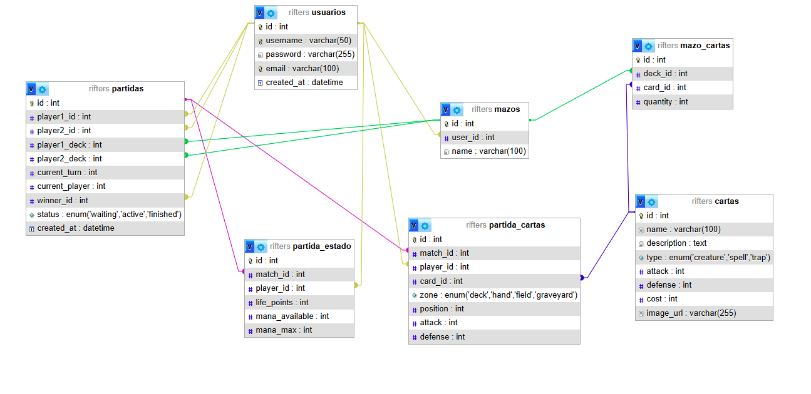
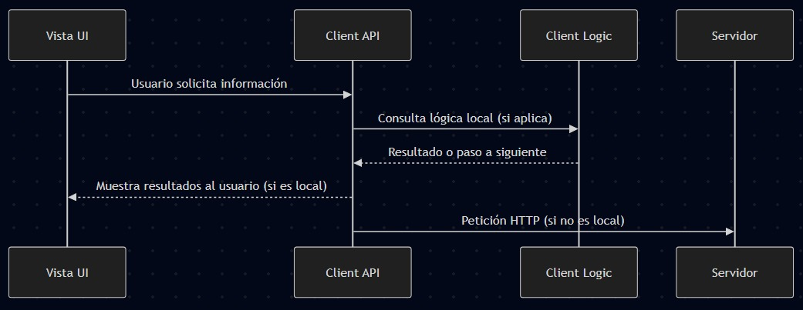
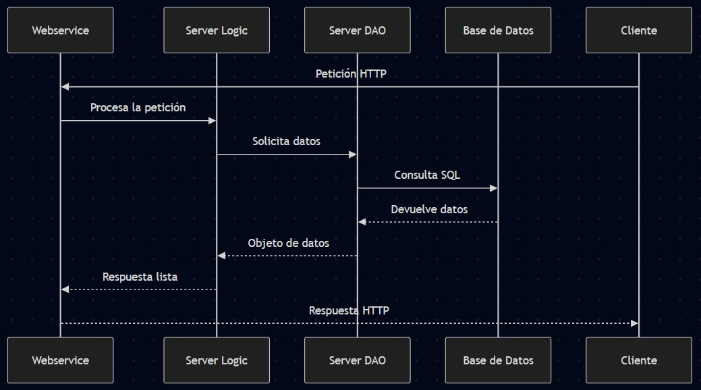
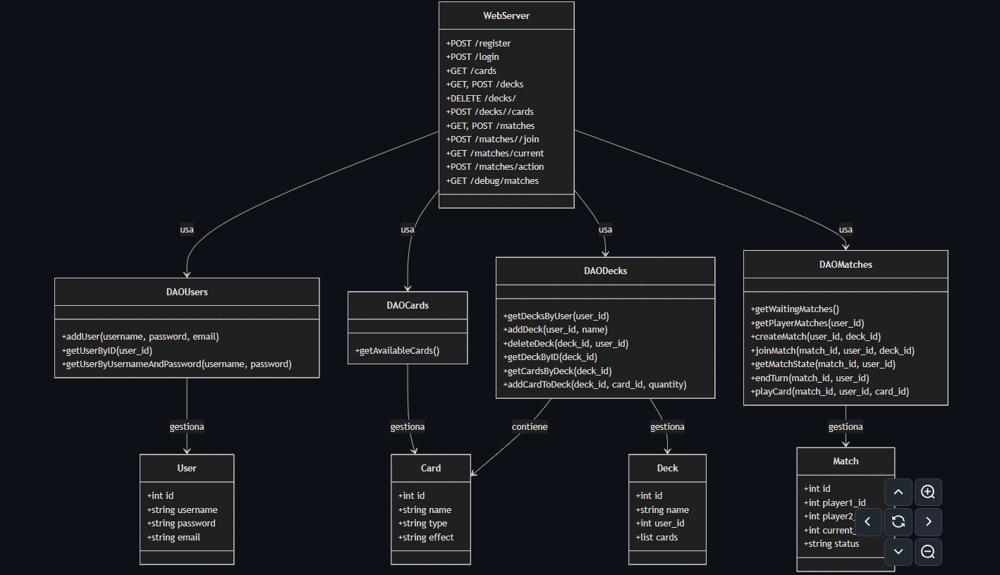

# Rifters

## Descripción del Proyecto Rifters

**Rifters** será un juego de cartas por turnos, inspirado en títulos como *Hearthstone*. El objetivo principal es permitir que dos jugadores se enfrenten en línea, cada uno utilizando su propio mazo de cartas.

Los jugadores podrán:
- Iniciar sesión en la plataforma.
- Visualizar y modificar sus cartas y mazos.
- Crear o unirse a una partida.

Una vez que ambos estén conectados, la partida comenzará y se desarrollará por turnos, permitiendo a cada jugador usar sus cartas de manera estratégica para derrotar al oponente.

Nuestro proyecto estará dividido en tres secciones principales:

**Cliente:** Interfaaz donde los jugadores interactúan con el juego.

**Servidor:** Lógica del juego, gestión de turnos, partidas y conexión con la base de datos.

**Bases de Datos:** Base de datos MySQL que se administrara mediante con phpMyAdmin, donde se almacenan usuarios, cartas, mazos, partidas, etc.

## Requisitos Técnicos del Proyecto

En este apartado describimos todos los requerimientos técnicos necesarios para el desarrollo de nuestor juego y ejecución del proyecto. Aquí detallamos tanto los aspectos del backend (servidor y lógica de negocio), como del frontend (cliente), infraestructura, herramientas de desarrollo y consideraciones de seguridad.

Enlace de ver los requerimientos:
[Requerimientos Técnicos](https://github.com/Dariella06/Rifters/blob/main/Requerimientos_tecnicos.md)

## Modelo E/R

En este apartado se muestra el Modelo E/R de nuestro proyecto, donde se puede ver la estructura de la base de datos. El diagrama representa la relación entre las distintas entidades involucradas, así como sus atributos y las conexiones lógicas que existen entre ellas. 

## Diagramas de Arquitectura Cliente / Servidor

A continuación se presentan los diagramas que describen la arquitectura del sistema desde dos perspectivas: **Cliente** y **Servidor**. Estos esquemas muestran los componentes principales y el flujo de información entre ellos, facilitando la comprensión de cómo interactúan ambos lados de la aplicación.

### Arquitectura del Cliente

El siguiente diagrama muestra cómo se organiza la lógica del cliente, desde la interfaz de usuario hasta la gestión de peticiones al servidor.

[Ver archivo Mermaid del Cliente](Diagramas/Cliente.mermaid)

### Arquitectura del Servidor

Este diagrama representa la estructura interna del servidor, incluyendo la API, la lógica del negocio y el acceso a la base de datos.

[Ver archivo Mermaid del Servidor](Diagramas/Servidor.mermaid)

### Descripció dels End-points del WebService

### Diagrama de classes del Backend

En este diagrama mostramos cómo organizamos nuestro servidor para el juego de cartas. Nosotros usamos un WebServer que tiene varios endpoints (como para registrarse, iniciar sesión, crear mazos, etc).

Para que el servidor funcione bien, conectamos varias clases DAO que se encargan de manejar los datos de usuarios, cartas, mazos y partidas. Cada DAO está relacionado con una entidad (User, Card, Deck, Match), y así separamos la lógica del servidor de la lógica de acceso a datos.

[Ver archivo del Diagrama del Backend](Diagramas/DiagramaBackend.mermaid)

### Diagrama de seqüència del Login

### Wireframes del Login i les següents pantalles
