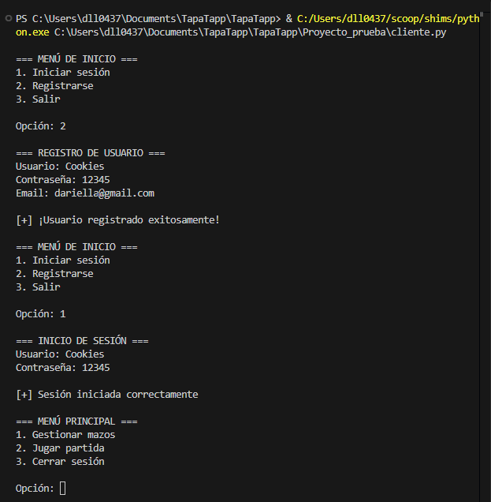

# Rifters

## Descripción del Proyecto Rifters

**Rifters** será un juego de cartas por turnos, inspirado en títulos como *Hearthstone*. El objetivo principal es permitir que dos jugadores se enfrenten en línea, cada uno utilizando su propio mazo de cartas.

Los jugadores podrán:
- Iniciar sesión en la plataforma.
- Visualizar y modificar sus cartas y mazos.
- Crear o unirse a una partida.

Una vez que ambos estén conectados, la partida comenzará y se desarrollará por turnos, permitiendo a cada jugador usar sus cartas de manera estratégica para derrotar al oponente.

Nuestro proyecto estará dividido en tres secciones principales:

**Cliente:** Interfaz donde los jugadores interactúan con el juego.

**Servidor:** Lógica del juego, gestión de turnos, partidas y conexión con la base de datos.

**Bases de Datos:** Base de datos MySQL que se administrará mediante phpMyAdmin, donde se almacenan usuarios, cartas, mazos, partidas, etc.

## Requisitos Técnicos del Proyecto

En este apartado describimos todos los requerimientos técnicos necesarios para el desarrollo de nuestro juego y ejecución del proyecto. Aquí detallamos tanto los aspectos del backend (servidor y lógica de negocio), como del frontend (cliente), infraestructura, herramientas de desarrollo y consideraciones de seguridad.

Enlace para ver los requerimientos:  
[Requerimientos Técnicos](https://github.com/Dariella06/Rifters/blob/main/Requerimientos_tecnicos.md)

## Modelo E/R

En este apartado se muestra el Modelo E/R de nuestro proyecto, donde se puede ver la estructura de la base de datos. El diagrama representa la relación entre las distintas entidades involucradas, así como sus atributos y las conexiones lógicas que existen entre ellas.


## Diagramas de Arquitectura Cliente / Servidor

Aquí se presentan diagramas que describen la arquitectura del sistema desde dos perspectivas: cliente y servidor. Estos diagramas muestran los principales componentes y el flujo de información entre ellos, facilitando la comprensión de cómo se conectan ambos lados del juego.

### Arquitectura del Cliente

El siguiente diagrama muestra cómo organizamos la lógica de los dos clientes, desde la interfaz de usuario hasta la gestión de peticiones al servidor.

[Ver archivo Mermaid del Cliente](Diagramas/Cliente.mermaid)


### Arquitectura del Servidor

El siguiente diagrama muestra la estructura interna del servidor, incluida la API, la lógica empresarial y el acceso a la base de datos.

[Ver archivo Mermaid del Servidor](Diagramas/Servidor.mermaid)


## Descripción de los Endpoints del WebService

En nuestro proyecto, los endpoints nos permiten registrarnos y acceder al juego mediante `/register` y `/login`, obteniendo un token para utilizar el resto de funcionalidades. Consultamos las cartas disponibles con `/cards` y gestionamos nuestros mazos con `/decks`: podemos verlos, crearlos, editar su contenido o eliminarlos. Para jugar, usamos `/matches` para ver, crear o unirnos a partidas. Durante una partida, utilizamos `/matches/current` para ver el estado, `/matches/action` para jugar cartas o pasar turno, y `/matches/<id>/surrender` si decidimos rendirnos.

### Host

`http://127.0.0.1:5000`

| Descripción                  | End-point                          | Método | Tipo de petición     | Parámetros                                                                                   |
|-----------------------------|------------------------------------|--------|----------------------|----------------------------------------------------------------------------------------------|
| Registrar usuario           | `/register`                        | POST   | `application/json`   | `username` (string), `password` (string), `email` (string)                                   |
| Iniciar sesión              | `/login`                           | POST   | `application/json`   | `username` (string), `password` (string)                                                     |
| Consultar cartas            | `/cards`                           | GET    | Token en header      | Token JWT en header `Authorization: Bearer <token>`                                         |
| Consultar mazos             | `/decks`                           | GET    | Token en header      | Token JWT                                                                                    |
| Crear mazo                  | `/decks`                           | POST   | `application/json`   | `name` (string), Token JWT                                                                   |
| Eliminar mazo               | `/decks/<deck_id>`                 | DELETE | Token en header      | Token JWT                                                                                    |
| Añadir carta a mazo         | `/decks/<deck_id>/cards`           | POST   | `application/json`   | `card_id` (int), `quantity` (int, opcional), Token JWT                                       |
| Ver partidas                | `/matches`                         | GET    | Token en header      | Token JWT                                                                                    |
| Crear partida               | `/matches`                         | POST   | `application/json`   | `deck_id` (int), Token JWT                                                                   |
| Unirse a partida            | `/matches/<match_id>/join`         | POST   | `application/json`   | `deck_id` (int), Token JWT                                                                   |
| Estado partida actual       | `/matches/current`                 | GET    | Token en header      | Token JWT                                                                                    |
| Realizar acción en partida  | `/matches/action`                  | POST   | `application/json`   | `action` (string: "play_card" o "end_turn"), `card_id` (int, si action es "play_card"), Token JWT |
| Rendirse en partida         | `/matches/<match_id>/surrender`    | POST   | Token en header      | Token JWT                                                                                    |

## Ejemplos de Respuestas

### `/register`

**201 Created**
```json
{
  "message": "Usuario registrado exitosamente",
  "user_id": 1
}
```

**400 Bad Request**

```json
{
  "error": "Todos los campos son requeridos"
}
```

### `/login`
**200 OK**

```json
{
  "token": "<jwt_token>",
  "user_id": 1,
  "username": "usuario",
  "message": "Sesión iniciada exitosamente"
}
```

**401 Unauthorized**

```json
{
  "error": "Credenciales incorrectas"
}
```

## Diagrama de Clases del Backend

La siguiente imagen muestra cómo está configurado el servidor del juego de cartas. Se utiliza un servidor web encargado de gestionar múltiples funciones, como el registro de usuarios, la administración de cartas y mazos, y la coordinación de las partidas.

Para el correcto funcionamiento del sistema, se han definido varias clases DAO (Data Access Object) encargadas de interactuar con la base de datos. Estas clases almacenan información relacionada con los usuarios, las cartas, los mazos y las partidas. Cada DAO está asociada a un módulo específico (Usuario, Carta, Baraja, Partida), lo cual permite separar la lógica de negocio de la lógica de acceso a datos.

[Ver archivo del Diagrama del Backend](Diagramas/DiagramaBackend.mermaid)

## Un caso detallado a escoger
### Descripción
El primer jugador entrara a iniciarse y crear una partida
El segundo jugaodr se registrara para luego iniciar su sessión y entrar a la partida del primer jugador

### Actores
- Player 1 (Creador de la partida)
- Player 2 (Jugador que se une)
- Sistema de juego

### Pre Condiciones
- Player 1 tiene que haber creado una partida y esta debe estar en estado "waiting"
- Player 2 tiene que haber entrado a una sesión iniciada
- Player 2 tiene que haber al menos un mazo creado con cartas
- La partida tiene que estar disponible (no llena)

### Post Condiciones
- Player 2 se unira a la partida con el mazo seleccionado
- La partida cambia su estado a "active"
- Se iniciaria el juego con Player 1 como jugador inicial

### Secuancias Normales
| Nº | Lo que hago yo (como cliente)                                                       | Lo que hace el sistema (servidor)                                                       |
| -- | ----------------------------------------------------------------------------------- | --------------------------------------------------------------------------------------- |
| 1  | Selecciono la opción para registrarme e ingreso mi nombre, correo y una contraseña. | Toma esos datos y los envía al servidor como un mensaje de tipo “registro”.             |
| 2  | —                                                                                   | Recibe la solicitud, la procesa y revisa si el correo ya está registrado.               |
| 3  | —                                                                                   | Si el correo no existe en la base de datos, registra mi información como nuevo usuario. |
| 4  | —                                                                                   | Me responde indicando si el proceso fue exitoso o si ocurrió algún error.               |
| 5  | Recibo la respuesta del sistema.                                                    | Me muestra si el registro fue exitoso o si hubo algún problema con el proceso.          |

### Exepciones
| Nº | Si pasa esto (como cliente)                                        | Entonces el sistema (servidor) debería...                                              |
| -- | ------------------------------------------------------------------ | -------------------------------------------------------------------------------------- |
| p  | Si se pierde la conexión mientras intento registrarme              | Mostrarme un mensaje de error claro y cancelar el proceso para evitar inconsistencias. |
| q  | Si ocurre algún problema interno con la base de datos del servidor | Manejar el error internamente, registrar el fallo y avisarme con un mensaje apropiado. |


### Rendimiento
En el sistema deberiamos realizar las acciones descritas en los pasos del 1 al 5 en un máximo de 5 segundos.

### Frequencia
En este caso se puede esperar a que se lleve a cabo probar unas 20 veces para comprobar el funcionamiento de cada opción. Comprobar desde crear un usario hasta poder entrar y jugar una partida.

### Importancia
Vital

### Urgencia
Immediatamente

### Comentarios
- En este caso, es fundamental el uso de acceso inicial de nuevos usuarios al sistema
- Requererimos validacoines minimas y también importantes del lado del servidor

## Diagrama de Secuencia del Login

El siguiente diagrama ilustra el flujo de autenticación en el juego. El proceso inicia en el menú principal, donde el usuario puede registrarse o iniciar sesión. Una vez autenticado, se accede al menú principal desde el cual se puede gestionar mazos o participar en partidas. Al finalizar la sesión, el usuario puede volver al menú de inicio.

[Ver archivo de Mermaid del Diagrama de Secuencia de Login](Diagramas/Diagrama_Sequencia_login.mermaid)


## Wireframes del Login y Pantallas Posteriores

En los wireframes diseñados para el sistema, el flujo comienza en una pantalla inicial que ofrece las opciones de iniciar sesión, registrarse o salir. Al ingresar correctamente, el usuario accede al menú principal, desde donde puede gestionar sus mazos, unirse o crear partidas, o cerrar sesión.

En la sección de gestión de mazos, el usuario puede crear nuevos mazos, editar su contenido o eliminarlos. En la sección de partidas, puede crear una nueva partida o unirse a una existente eligiendo el mazo con el que desea jugar.

Durante una partida, se recorren las distintas fases del juego: robar, jugar, atacar y finalizar turno. Al concluir la partida, se muestran los resultados y se ofrece la opción de solicitar una revancha o regresar al menú principal.

[Ver archivo de Wireframes de Login](Diagramas/Wireframes_Login.mermaid)

### Ejemplo del Login o Crear un nuevo usuario



### Test Unitarios para comprobar nuestro videojuego de cartas
