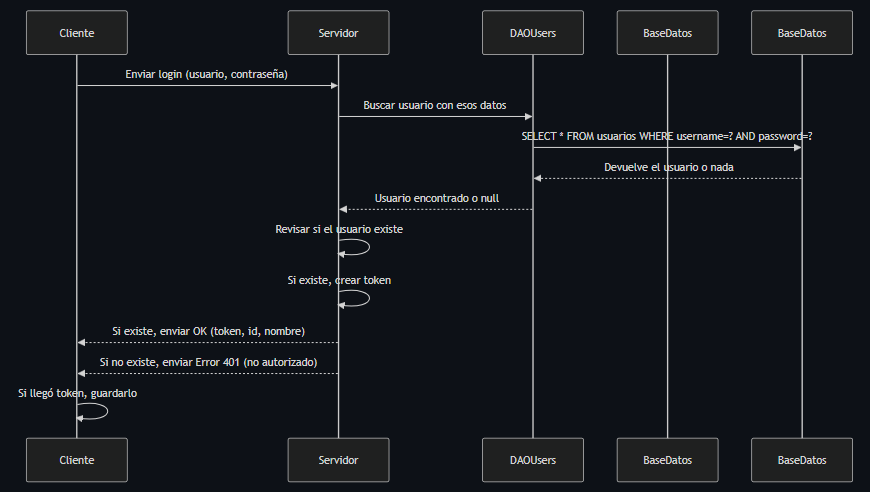

# Rifters

## Descripción del Proyecto Rifters

**Rifters** será un juego de cartas por turnos, inspirado en títulos como *Hearthstone*. El objetivo principal es permitir que dos jugadores se enfrenten en línea, cada uno utilizando su propio mazo de cartas.

Los jugadores podrán:
- Iniciar sesión en la plataforma.
- Visualizar y modificar sus cartas y mazos.
- Crear o unirse a una partida.

Una vez que ambos estén conectados, la partida comenzará y se desarrollará por turnos, permitiendo a cada jugador usar sus cartas de manera estratégica para derrotar al oponente.

Nuestro proyecto estará dividido en tres secciones principales:

**Cliente:** Interfaaz donde los jugadores interactúan con el juego.

**Servidor:** Lógica del juego, gestión de turnos, partidas y conexión con la base de datos.

**Bases de Datos:** Base de datos MySQL que se administrara mediante con phpMyAdmin, donde se almacenan usuarios, cartas, mazos, partidas, etc.

## Requisitos Técnicos del Proyecto

En este apartado describimos todos los requerimientos técnicos necesarios para el desarrollo de nuestor juego y ejecución del proyecto. Aquí detallamos tanto los aspectos del backend (servidor y lógica de negocio), como del frontend (cliente), infraestructura, herramientas de desarrollo y consideraciones de seguridad.

Enlace de ver los requerimientos:
[Requerimientos Técnicos](https://github.com/Dariella06/Rifters/blob/main/Requerimientos_tecnicos.md)

## Modelo E/R

En este apartado se muestra el Modelo E/R de nuestro proyecto, donde se puede ver la estructura de la base de datos. El diagrama representa la relación entre las distintas entidades involucradas, así como sus atributos y las conexiones lógicas que existen entre ellas. 

## Diagramas de Arquitectura Cliente / Servidor

Aquí verá diagramas que describen la arquitectura del sistema desde dos perspectivas: cliente y servidor. Estos diagramas muestran los principales componentes y el flujo de información entre ellos, facilitando la comprensión de cómo se conectan los dos lados del juego.

### Arquitectura del Cliente

El siguiente diagrama muestra cómo organizamos la lógica de los dos clientes, desde la interfaz de usuario hasta la gestión de peticiones al servidor.

[Ver archivo Mermaid del Cliente](Diagramas/Cliente.mermaid)

### Arquitectura del Servidor

El siguiente diagrama muestra la estructura interna del servidor, incluida la API, la lógica empresarial y el acceso a la base de datos.

[Ver archivo Mermaid del Servidor](Diagramas/Servidor.mermaid)

## Descripció dels End-points del WebService

## Diagrama de classes del Backend
La imagen a continuación muestra cómo configuramos el servidor del juego de cartas. Utilizamos un servidor web que realiza diversas funciones (como registro, registro, recolección, etc.).

Para que el servidor funcione correctamente, definimos varias tablas DAO para almacenar información sobre el usuario, la carta, el mazo y el juego. Cada DAO está asociado a un grupo (Usuario, Carta, Baraja, Partida), por lo que separamos la lógica del servidor de la lógica de acceso a los datos.

[Ver archivo del Diagrama del Backend](Diagramas/DiagramaBackend.mermaid)

## Diagrama de Secuencia del Login
El siguiente ejemplo muestra cómo utilizamos para el juego: Comienza desde el menú donde podrás registrarte o iniciar sesión, una vez que inicies sesión, serás llevado al menú principal donde podrás elegir entre administrar los mazos o las partidas. También puedes volver al inicio al final de la sesión.

[Ver archivo de Mermaid del Diagrama de Secuencia de Login](Diagramas/Diagrama_Sequencia_login.mermaid)

## Wireframes del Login i les següents pantalles
